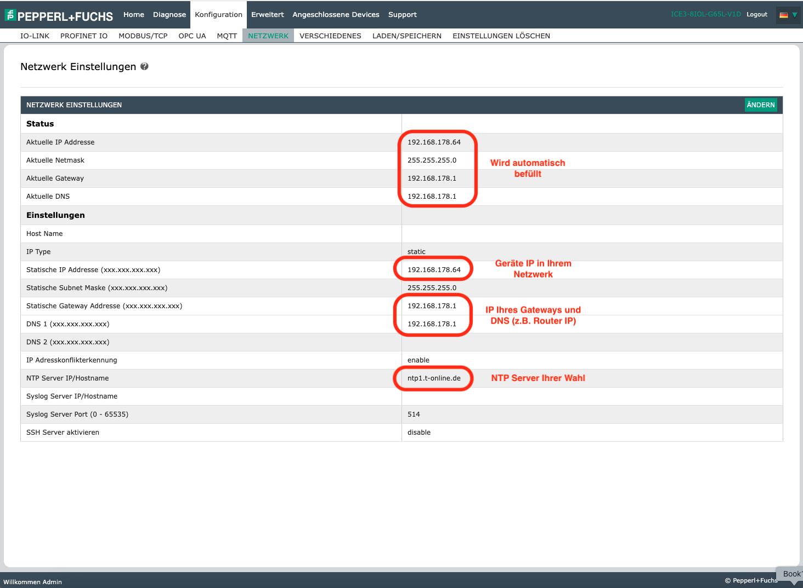
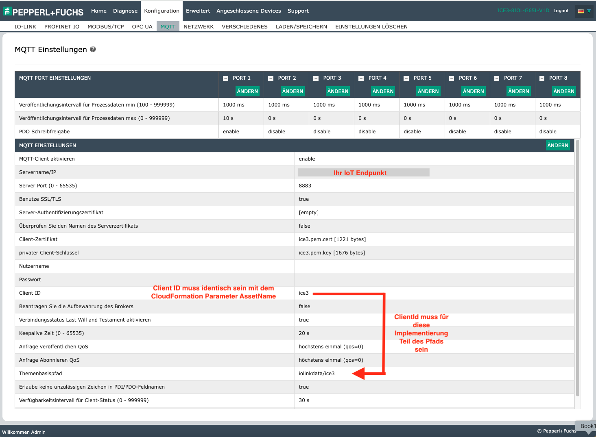

Dies ist Beispielcode, nicht für den Produktiveinsatz gedacht.
Sie sollten mit Ihren Sicherheits- und Rechtsteams zusammenarbeiten, um die Sicherheits-, Regulierungs- und Compliance-Anforderungen Ihrer Organisation vor der Bereitstellung zu erfüllen.

# Vom Sensor zur Cloud: Nachrüstung von Maschinen mit IO-Link und AWS

[](https://github.com/aws-samples/retrofitting-with-io-link/blob/master/README.md)
[](https://github.com/aws-samples/retrofitting-with-io-link/blob/master/README.de.md)

## Hardware-Anforderungen
* Pepperl+Fuchs IO-Link Master Modell ICE3-8IOL-G65L-V1D 
* Pepperl+Fuchs IO-Link Abstandssensor Modell OMT550-R200-2EP-IO-V1  
  
Beide Komponenten sind auch Teil des Pepperl+Fuchs 'IO-Link Starter Kit'.

## AWS-Einrichtung


Die folgenden Anweisungen verwenden die AWS CLI.  
Wenn Sie den Stack lieber über die Konsole erstellen möchten, können Sie dieser [Anleitung](https://docs.aws.amazon.com/de_de/AWSCloudFormation/latest/UserGuide/cfn-console-create-stack.html#create-stack) unter Nutzung der Option "Vorlage hochladen" folgen.  
Nach der Erstellung des Stacks finden Sie im Ausgabe-Tab des Stacks Links zu den erforderlichen Eingaben.

### Stack erstellen
```bash
cd demo-setup
sh ./deploy.sh -o c # c = create, u = update, t = delete
cd -
```

### Optional: Erweiterung zur Nutzung von Geräteschatten erstellen
Dieser Stack enthält die Logik um die Status Nachrichten des Masters in Geräteschatten zu persistieren.


Um die Erweiterung zu provisionieren nutzen Sie diese Befehle
```bash
cd device-shadow-addon
sh ./deploy.sh -o c # c = create, u = update, t = delete
cd -
```

## Pepperl+Fuchs ICE Einrichtung

* Laden Sie IODD des Distanzsensors von der [iodd-finder.com](https://ioddfinder.io-link.com/productvariants/search?productName=%22OMT550-R200-2EP-IO-0,3M-V1%22) Website herunter
* Verbinden Sie den Master mit Ihrer Stromversorgung und dem Netzwerk. Schauen Sie in die Handbücher der Kabel oder Stromversorgung, wenn Sie weitere Hinweise benötigen. Diese finden Sie auf der Pepperl+Fuchs Webseite
* Verbinden Sie den Abstandssensor mit Port 1
* Öffnen Sie die Weboberfläche in Ihrem Browser durch Eingabe der IP-Adresse. Die zu verwendende IP ist auf dem Gerät aufgedruckt. Falls die Standard-IP in Ihrem Netzwerk nicht verwendet werden kann, lesen Sie im Handbuch des Geräts nach, wie Sie die Standard-IP ändern können
* Laden Sie die IODD .zip-Datei auf das Gerät hoch


* Netzwerk konfigurieren 


* MQTT aktivieren  
Das erforderliche Zertifikat und der Schlüssel befinden sich im ```.demo-setup/cert``` Ordner des Projekts, der im Rahmen der Ausführung des ```deploy.sh``` Skripts erstellt wurde. Der erforderliche IoT-Endpunkt wird ebenfalls vom Skript ermittelt und ausgegeben.


## Validieren
In der AWS IoT Sitewise Console sind die eingehenden Werte nun zu beobachten.


Alternativ kann auch über die Sitewise API, z.B. via AWS CLI eine Abfrage gestartet werden.  
Diese Abfrage frage z.B. die historischen Werte der letzen 5 Minute ab.
```bash
time_now=$(date +%s)
five_minutes_before=$((time_now - (5 * 60)))

aws iotsitewise get-asset-property-value-history \
  --property-alias "iolinkdata/ice3/port/1/pdi" \
  --start-date $five_minutes_before \
  --end-date $time_now

```

### Stack löschen
```bash
sh ./deploy.sh -o t
```

## Mögliche Erweiterungen der Architektur
Die Architektur lässt sich auf vielfältige Weise erweitern:
* AWS IoT Greengrass ermöglicht es, die Daten am Edge zu prozessieren, bevor sie an die AWS Cloud oder andere Applikationen übergeben werden
* Applikationen können die Daten abonnieren oder weitergeleitet bekommen
* Datenvisualisierung
* Anbindung von Sprachmodellen über Bedrock Agents
* Nutzung der Daten in weiteren Applikationen durch die SiteWise API
* Datenexport nach Amazon S3 zur Weiternutzung z.B. durch Analytics-Applikationen
