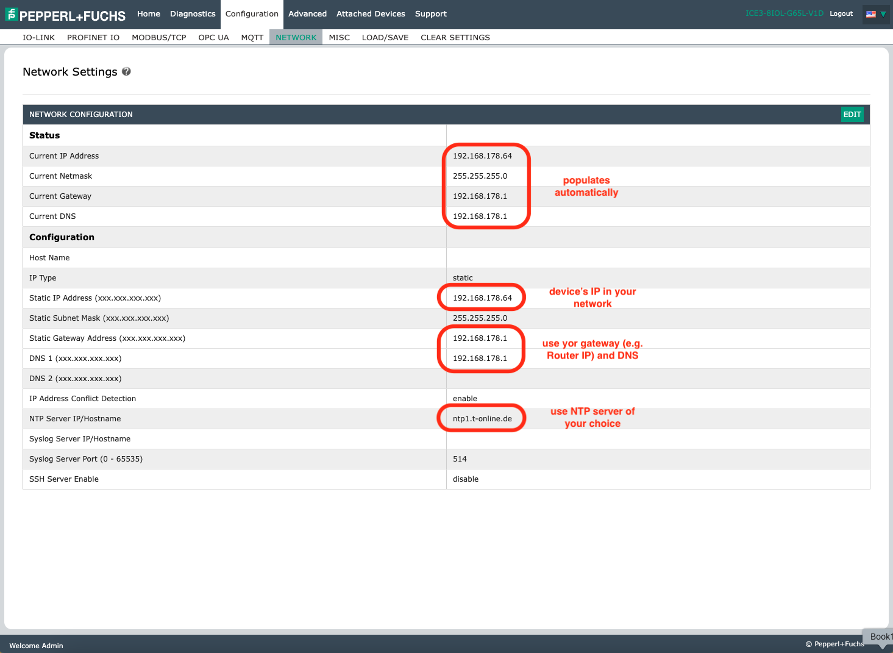

This is sample code, for non-production usage. 
You should work with your security and legal teams to meet your organizational security, regulatory and compliance requirements before deployment

# From sensor to the Cloud: Retrofitting of machines with IO-Link and AWS

[](https://[github.com/jonatasemidio/multilanguage-readme-pattern](https://github.com/aws-samples/retrofitting-with-io-link)/blob/master/README.md)
[](https://github.com/aws-samples/retrofitting-with-io-link/blob/master/README.de.md)

## Overview
This demo shows how to generate new digital capabilities for existing machines and process setups by connection a Pepperl+Fuchs IO-Link master to the AWS cloud. We register the data in AWS IoT Sitewise, a service build to ingest and analyze industrial data.

## Hardware requirements
* Pepperl+Fuchs IO-Link master model ICE3-8IOL-G65L-V1D 
* Pepperl+Fuchs IO-Link distance sensor model OMT550-R200-2EP-IO-V1  
  
Both components are also part of the Pepperl+Fuchs 'IO-Link Starter Kit'.

## AWS Setup


Below setup instructions use AWS CLI.  
If you prefer to build the stack using the console, you can follow these [instructions](https://docs.aws.amazon.com/AWSCloudFormation/latest/UserGuide/cfn-console-create-stack.html#create-stack) using the Option "Upload template".  
Once created, check the outputs tab of the stack for links to required inputs.

### Create stack
```bash
cd demo-setup
sh deploy.sh -o c # c = create, u = update, t = delete
cd -
```

### Optional: Addon for device shadow
This addon stack takes the status messages of the devie and turns it into device shadows to persist them.


To provision the addon use these commands
```bash
cd device-shadow-addon
sh deploy.sh -o c # c = create, u = update, t = delete
cd -
```

### Optional: Addon for last will
This addon stack sends an Email via SNS in case the device's last will message is emmitted by the broker due to an ungraceful disconenction of the device.  
Make sure to confirm your subscription through the email you will receive uposn subscription is created.


To provision the addon use these commands
```bash
cd last-will-addon
sh deploy.sh -o c -e INSERT-YOUR-EMAIL # -o: c = create, u = update, t = delete
cd -
```

## Pepperl+Fuchs ICE Setup

* Download IODD for the distance sensor from the [iodd-finder.com](https://ioddfinder.io-link.com/productvariants/search?productName=%22OMT550-R200-2EP-IO-0,3M-V1%22) website
* Connect the master to your powersupply and network. Lookup the manuals of the cables or powersupply if you need further advise. They can be found on the Pepperl+Fuchs website.
* Connect the distance sensor to port 1
* Open the webinterface in your browser by entering the IP adress. The IP to use is printed on the device. In case the default IP cannot be used in your network, lookup how to change default IP in the manual of the device. 
* Upload the IODD .zip file to the device


* Configure network  


* Enable MQTT  
The required certificate and key can be found in the ```./demo-setup/cert``` folder of the project that was created as part of the ```deploy.sh``` script run. The required IoT endpoint will also be outputed by the script.


## Validation

Open the [MQTT test client](https://console.aws.amazon.com/iot/home?#/test) ion the AWS console.  
Make sure you are in the proper region!  
Use option 'Subscribe to a topic' and use ```iolinkdata/ice3``` as a topic filter.  
You now will see the sensor data incoming, e.g. here a sample of teh sensor measurements:
```json
{
  "port": 1,
  "valid": 1,
  "uint": 270859269,
  "P_ProcessData0": {
    "MV___Distance": 4132,
    "Scale": -4,
    "SSC1___Switching_Signal_1": true,
    "SSC2___Switching_Signal_2": false,
    "Signal_Quality_Indicator": 1
  },
  "raw": [
    16,
    36,
    252,
    5
  ]
}
```

In the AWS IoT Sitewise console you now can see the incoming data


You can also use the Sitewise API, e.g. by running following command in AWS CLI to get data of last 5 minutes.
```bash
time_now=$(date +%s)
five_minutes_before=$((time_now - (5 * 60)))

aws iotsitewise get-asset-property-value-history \
  --property-alias "iolinkdata/ice3/port/1/pdi" \
  --start-date $five_minutes_before \
  --end-date $time_now

```

## Possible extensions of architecure
The architecture can be extended in various ways:
* AWS IoT Greengrass enables data processing at the edge before transferring it to AWS Cloud or other applications
* Applications can subscribe to or receive forwarded data
* Data visualization
* Integration of language models via Bedrock Agents (checkout this repo: https://github.com/aws-samples/aws-iot-sitewise-conversational-agent)  
* Use of data in other applications through the SiteWise API
* Data export to Amazon S3 for further use, e.g., through analytics applications


